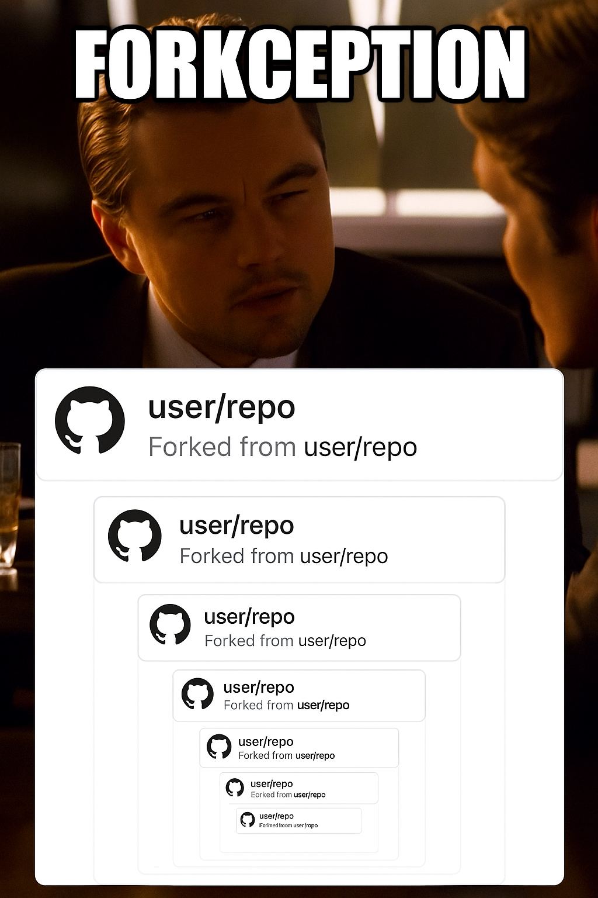

# ulauncher-cursor-recent

> 💻 Open recent Cursor folders and files using Ulauncher.

Quickly open recently-opened Cursor project directories and files.

**Fork History**

This extension [slimneotech/ulauncher-cursor-recent](https://github.com/slimneotech/ulauncher-cursor-recent) is a fork of [GEkuL/ulauncher-cursor-recent](https://github.com/GEkuL/ulauncher-cursor-recent) (**GEkuL**), which itself is a fork of [plibither8/ulauncher-vscode-recent](https://github.com/plibither8/ulauncher-vscode-recent) (**plibither8**) to support Cursor as opposed to vanilla VS Code.

<p align="left">
  
</p>


**New:**
- thefuzz or fuzzywuzzy is now an optional dependency
- Supports disabling no match actions
- Supports excluding paths

**[Cursor](https://www.cursor.com/)** is a fork of VS Code enhaced with AI features developed by [Anysphere](https://anysphere.inc/).

## Install

### Requirements

- [Ulauncher 5](https://ulauncher.io/)
- Python >= 3

### Optional requirement
- `thefuzz` or `fuzzywuzzy` module.
  Install this using `pip`: `pip install thefuzz` or `pip install fuzzywuzzy`

### Steps

1. Ulauncher > Preferences > Extensions > Add extension

2. Paste the following URL:

```
https://github.com/gekul/ulauncher-cursor-recent
```
3. Create cursor shortcut to be available from bash.
    <details>
    <summary>Reasoning</summary>
    Cursor is currently distributed as an AppImage binary.

    Which gets updated changing the name and has no terminal command by default, therefore, can't be called by the plugin.

    Thus, let's add shortcut to have your `cursor` available from bash.
    </details>

   
   1. `sudo nano /bin/cursor` and 
   2. paste (*ctrl+shift+v*):
      ```
      #!/bin/bash
      cd /your/path/to/AppImageBinary
      ./cursor-*.AppImage $1 $2
      ```
   3. Save (*ctrl+o*) and Exit (*ctrl+x*)
    <details>
    <summary>Script Explanation</summary>
    This script calls your Cursor binary with the first 2 arguments received.
    </details>

This extension should now be set up and work.

## Usage

Default keyword to trigger this extension is **`r`**. This can be changed in the preferences.

### Options

- **Trigger keyword (`code_kw`)**: The keyword to activate this extension in Ulauncher. Default is `r`.
- **Excluded environment variables (`excluded_env_vars`)**: Comma-separated list of environment variables to remove when starting Cursor (e.g., `PYTHONPATH`).
- **Create File Option (`create_file`)**: If set to Yes, allows you to create a new file or open a path directly from the query if it doesn't match a recent entry.
- **Exclude Directory (`exclude_dir`)**: Comma-separated list of directory substrings. Any recent file or folder whose path contains one of these substrings will be excluded from the results.

## License

This source code is released under the [MIT](LICENSE) license.

The icons were adjusted from [github.com/vscode-icons/vscode-icons](https://github.com/vscode-icons/vscode-icons), which are available under the Creative Commons - ShareAlike (CC BY-SA) license.
